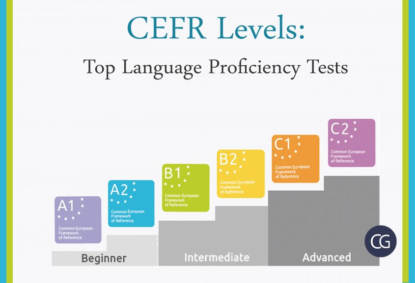

+++
title = 'Programming Language Proficiency'
date = 2024-09-26T12:38:13+01:00
publishDate = 2024-09-30T12:38:13+01:00
draft = true
tags = ["programming theory", "golang"]
author = "Joe Moon Whitehead"
+++

# Measuring programming language proficiency

Whilst reading _Ultralearning_ by Scott H. Young I began thinking about how we learn programming languages.

My language project right now is to learn Go (this site is built on Hugo, a Go static site framework!) to the point
where I can program fairly complex software & services in it, ideally to the level I can use Python. When learning anything,
the first hurdle becomes __direction__ - where do I go and when to maximise my learning whilst minimising the roadblocks,
frustrations, and confusion that comes with big learning curve leaps or non-linear learning paths. If you're lost, you're
not learning.

_Ultralearning_ opens with a story about a man called Benny Lewis forcing himself to learn human languages to a
conversational, sometimes almost fluent, level within 3 months. How does he measure his goals? Well, human language
has the massive advantage of having entire institutions setup for its learning, and these institutions provide __language
proficiency levels__. These are _A1, A2, B1, B2, C1, C2_, increasing in proficiency from left to right. It's called the
__CEFR Scale__



All widely spoken languages are measured in these levels. Exams are taken to reach each level, overseen by an
institution for each language that I assume is appointed in some way or another. 

The exams themselves don't matter as much as the tiering of understanding that each level represents. A1 is a complete
beginner that knows basic words and maybe some phrases, whereas C2 is defined as a full fluency with an ability to understand
words & context in any scenario with any topic.

So I thought to myself... why can't we do the same for programming languages?

### Levels of programming language efficiency

Even without a governing body to measure and enforce levels of proficiency, can we outline generalised levels of expertise
that are measurable? Are we able to place goalposts that define when a programmer has earned a degree of fluency with a
programming language?

The first important distinction to make is that we are measuring fluency in a _programming language_, not programming itself.
Whilst they'll share knowledge and often will develop together, we aren't looking to measure a programmer's fluency in the
more general, abstract programming concepts that apply between languages.

#### A1

Our first level will cover the basic syntax of the language. Nothing super fancy like JavaScript's _Futures_ or 
Go's _Goroutines_ or overriding Python dunder methods, because despite these being essential concepts in these languages,
they are not the simplest.

We are looking to emulate basic words and phrases from human languages. The Hellos, Goodbyes, Pleases, and Thank Yous of
the world.

Taking Go as an example, you would first learn the simplest way to assign a variable

```go
a := 1
```

The above does not even include defining the variables type, as Go does it implicitly for us with this syntax. This
removes a level of understanding required (knowledge of strongly-typed languages) and means a programmer can make a very
basic variable assignment. This, to me, is the Hello of Go.

A function might be the Please of Go. How do we define a very basic function with extremely basic functionality?

```go
func addTwoNumbers(a int, b int) int {
    return a + b
}
```

This is the simplest example I could think of that is not completely trivial - like a simple print statement, which would
really make it a _procedure_ if we're getting technical. But beginners don't need to be technical, they just need to know
the basics. If they can write this function and understand its different parts, then they are on their way to being A1
in Go
